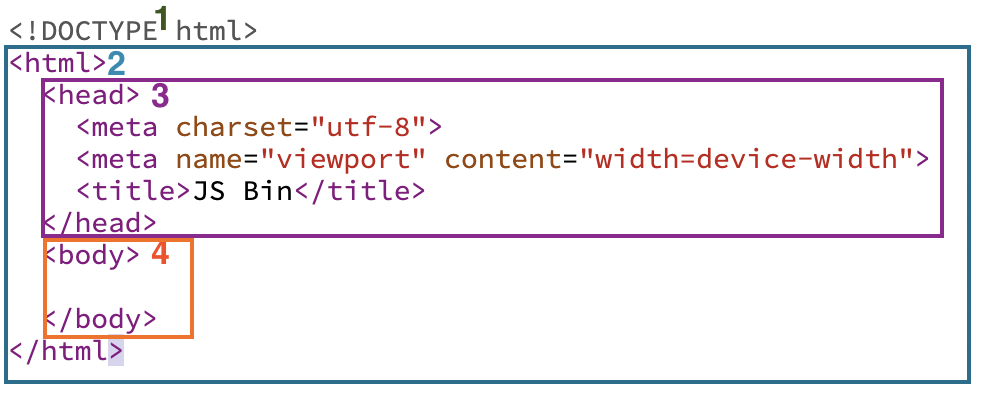
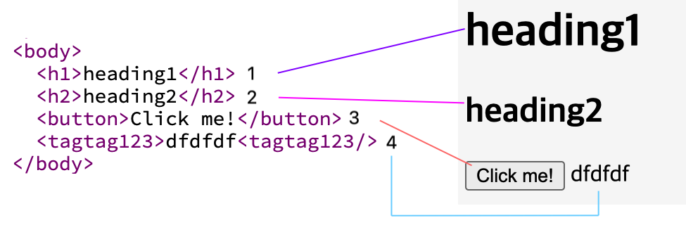
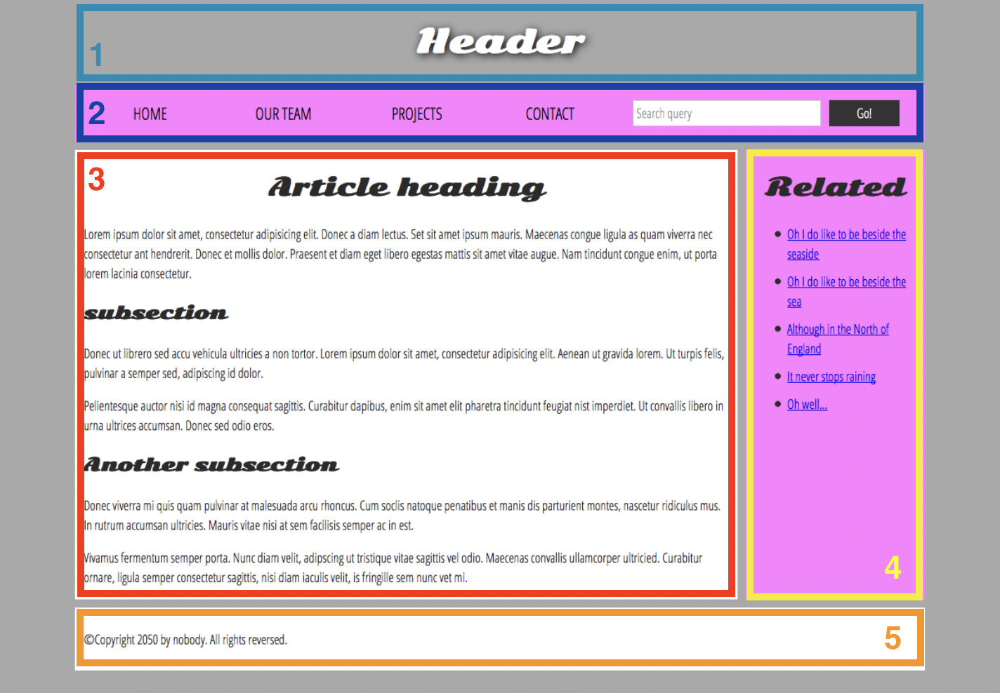
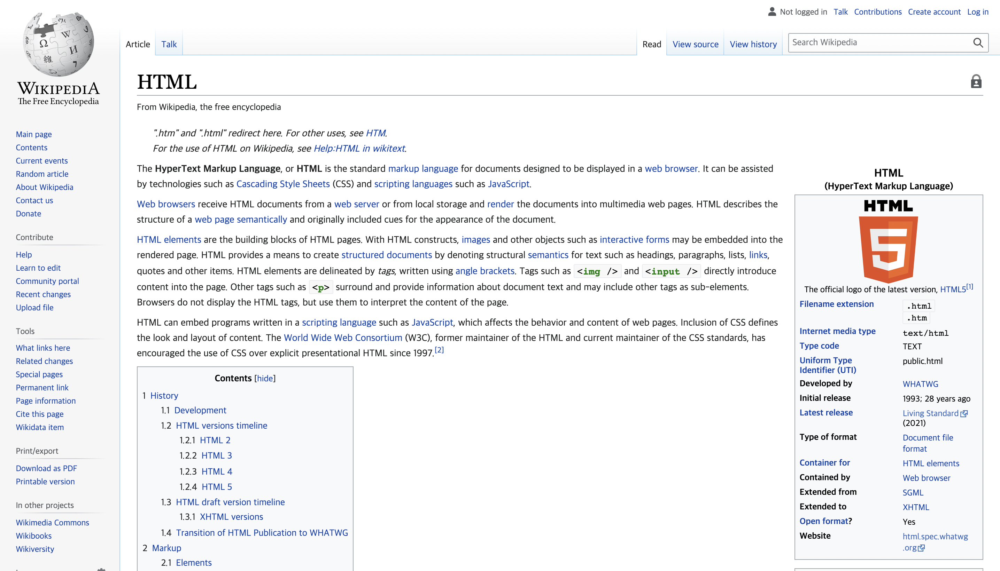
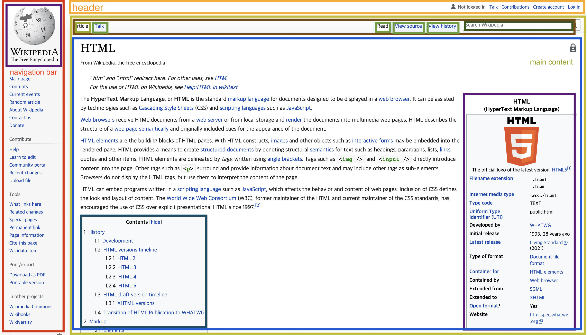

# 1. HTML 기본 구조
## < 목차 >
1. HTML이란?
1. HTML의 기본 구조
1. 문서의 기본 섹션
1. 섹션 나누기 (실습)   

## 1. HTML이란?
: __standard markup language__ for __documents__ designed to be __displayed in a web browser.__ 
웹을 이루는 가장 기본적인 building block. 
웹 컨텐츠의 구조와 의미를 결정하는 문서.

+ 마크업 언어(Markup language)
: 태그를 이용해 구조적으로 작성해야하는 언어.

+ 태그 : <>와 안에 있는 문자(+/)로 구성되어 있는 HTML 요소.  
열기 태그와 닫기 태그로 이루어져 있으며,  
각 요소는 열기 태그와 닫기 태그 사이에 있는 정보 사항을 브라우저에게 알려줌.
(like 컨테이너)
  

## 2. HTML의 기본 구조

1. !DOCTYPE : 문서 타입 정의
1. &lt;html&gt; : html 파일의 최상위 태그
1. &lt;head&gt; : 메타데이터 위치 (ex- 구글검색키워드, 북마크 시 제목or아이콘, CSS 파일 연결 등), 유저에게 보여지는 정보는 x
1. &lt;body&gt; : 유저에게 보여지는 정보값을 담는 컨테이너
  

+  태그 실습

1. &lt;h1&gt; : 제목 1 태그
1. &lt;h2&gt; : 제목 2 태그
1. &lt;button&gt; : 누를 수 있는 버튼 생성 태그
1. 태그 오류 : 간혹 태그에 오류가 나면 문맥 상 가장 유사한 태그의 역할을 수행함. 
그러나 코드가 길어지면 예상치 못한 충돌이 생길 수 있으니 최대한 태그 오류를 줄이는 것이 좋음. 
ㄴ 태그 오류 검사 사이트 : https://validator.w3.org/

+ W3C (World Wide Web Consortium)
: 웹의 표준화를 추진하는 단체. 
본 단체에서 규약된 태그를 이용해 웹 구축 시, 다양한 브라우저에 구애받지 않는 작업이 가능.

+ 웹 개발 정보 : https://developer.mozilla.org/ko/
  

## 3. 문서의 기본 섹션

1. header 
: 일반적으로 제목/로고가 있는 섹션.  
1. navigation bar 
: 홈페이지의 메인 섹션들을 연결하는 섹션.
대부분 메뉴 버튼이나 링크, 탭으로 표현. 
웹사이트 내 일관적인 내비게이션을 제공해야 사용자가 통일성과 직관성을 느낄 수 있음.   
1. main content 
: 웹페이지 내 가장 독특한 컨텐츠를 포함하는 중심부 큰 부분.  
1. sidebar 
: 주변 정보, 링크, 인용부호, 광고 등을 나타내는 데 이용하는 섹션. 
때에 따라 보조 navigation system으로 이용하기도 함.  
1. footer 
: 페이지 바닥의 줄. 일반적으로 작은 정보, 저작권, 또는 연락처가 포함됨. 
일반적이지만 중요하지 않거나 부차적인 정보를 담고 있는 경우가 많음. 
가끔 SEO(Search Enging Optimization) 목적의 [인기컨텐츠 바로 가기] 기능을 담기도 함.  

## 4. 문서 섹션 나누기 (실습)
+ 위키피디아 HTML 페이지 (원본)

+ 실습
  
피드백 : 텍스트 단락 및 버튼들 나눌 것. 
 전체적인 섹션을 나눈 것은 확인했으나, 요소들이 독립적이라면 가급적 모두 나누는 게 좋다. (너무 많으면 나눈다는 것만 숙지하고 넘어가도 됨.)