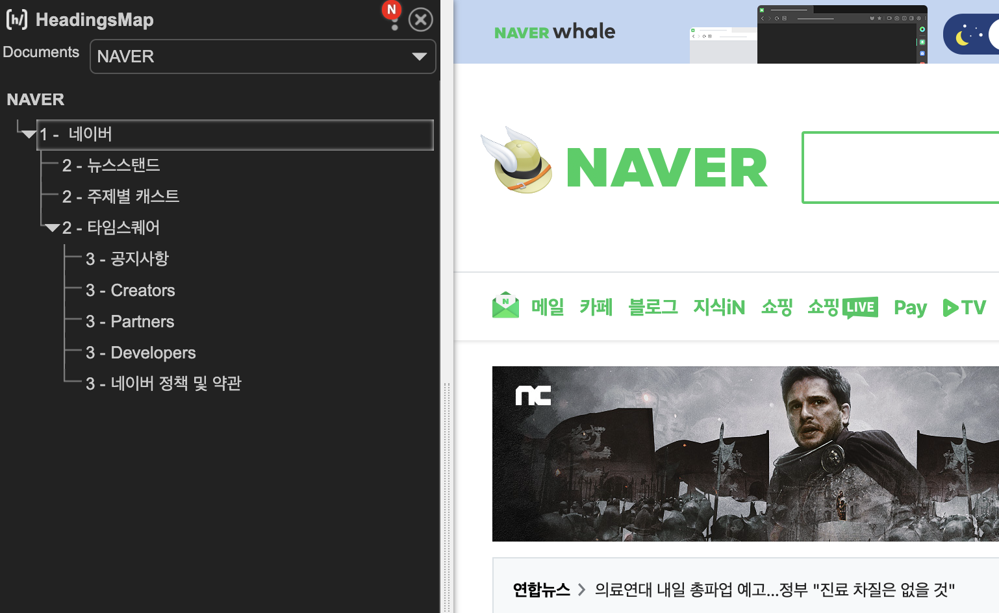

# 1-4. heading 태그

## < 목차 >

1. head를 제거하면?
1. heading 태그
1. 실습 - heading 태그 이용하기
   <br/><br/>

## 1. head를 제거하면?

- 지금까지 콘솔에 입력했던 코드 : 해당 코드의 head를 제거하는 명령.

```html
document.head.parentNode.removeChild(document.head);
```

그런데 head를 없앴더니 css가 사라졌다?<br/>
-> 우리는 head 태그에 css가 들어가야 한다는 걸 추론할 수 있음.<br/><br/>

## 2. heading 태그

- 네이버 메인 창에서 가장 중요한 컨텐츠는 무엇일까?<br/>
  -> ""네이버""라는 걸 보여주는 것이 가장 중요<br/><br/>
  한 페이지 내에서 어떤 요소들이 중요한지 꼽을 수 있고, <br/>
  키워드에 따라 그룹을 묶을 수도 있음.<br/>
  => 이런 키워드 및 머리말들을 heading 태그로 묶을 수 있음.<br/>
  중요도에 따라 h1 ~ h6 태그까지 부여할 수 있음.<br/>
  (같은 중요도라면 똑같은 태그 사용도 가능)<br/>
  주로 자신의 사이트 이름을 h1로 부여하는 경우가 많음.<br/><br/>

## 3. 실습 - heading 태그 이용하기

- 추천 크롬 확장프로그램 : headingsMap<br/>
  
  heading 태그의 쓰임을 직관적으로 보여준다. <br/>
  -> 해당 사이트가 어떤 순위로 컨텐츠를 배치 및 이용했는지 알아볼 수 있음.<br/>
  검색엔진이 방문했을 시, 문서의 제목이나 설명, headings 들을 참고해 긁어갈 수 있음.<br/>
  단, heading 태그를 쓰지 않은 키워드는 인식하지 않을 수 있음에 주의.<br/><br/>


그만큼 중요도도 낮아진다는 것을 뜻함<br/><br/>
heading는 숫자가 커질수록 점점 작아짐.<br/>

- 오늘의 꿀팁! **내일 실습하기!**<br/> 

1. shift + option(alt in win) + 아래 방향키 <br/>
   : 블록된 코드를 그대로 아래 행에 복사

1. shift + option(alt in win) + 좌우 방향키 <br/>
   : 단어 선택

1. shift + command + 좌우 방향키 <br/>
   : 전체 선택

1. command + 상하좌우 방향키
   : 상하 - 맨 첫/마지막 코드로 이동
   좌우 - 해당 코드의 처음/끝으로 이동
