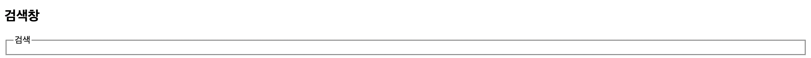
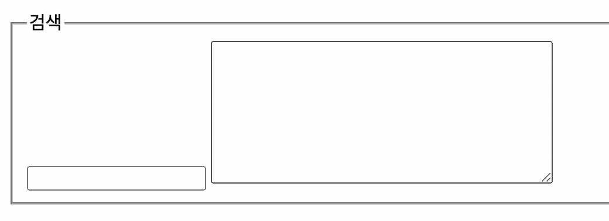
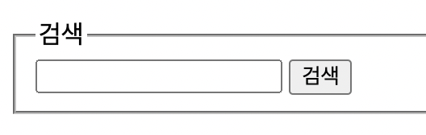
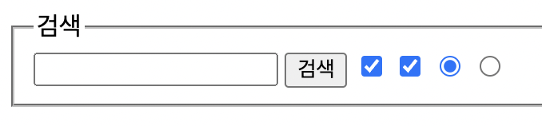
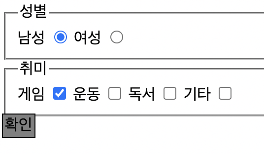

# 4. 자주 쓰는 다양한 태그들

## < 목차 >

1. a
1. fieldset
1. input / textbox
1. checkbox / radio
1. button <br/><br/>

## 1. a
다른 웹페이지로 넘어갈 수 있게 하는 "링크" 태그.<br/>
링크 위에 커서를 올리면 일반적 커서 모양에서 손가락 표시로 바뀜.<br/>
&lt;a&gt; 태그만으로는 어느 링크를 열지 알 수 없기 때문에, 뒤에 href 등을 통해 부가정보를 덧붙여야함.<br/>
-> 이런 부가정보를 속성(attributes)이라고 부름.<br/>
ex) lang="ko", charset, rel, type, href 등..

```html
    <h1>
      <a href="http://www.naver.com">
        네이버
      </a>
    </h1>
```
ㄴ 어떤 링크든 열 수 있기 때문에, http://www 를 함께 붙여주어야 웹페이지로 열림.
- 주석(comment)
  : 화면에 뜨지 않게 만든 정보<br/>
  주석 만드는 법 ->

```
<!-- 주석입니당 -->
```

## 2. fieldset
연관된 요소를 하나의 그룹으로 묶을 때 사용하는 태그. <br/>
또한 하나의 그룹으로 묶은 요소 주변으로 박스 모양의 선도 함께 생김. <br/>
&#43; legend 태그를 통해 fieldset의 제목을 정할 수 있음.

```html
<fieldset>
   <legend>검색</legend>
</fieldset>
```


<br/><br/>

## 3. input / textarea
텍스트를 입력할 수 있는 기능.
+ textarea : 입력 기능 + 사용자 정의로 크기 변경 가능
```html
<fieldset>
   <legend>검색</legend>
   <input />
   <textarea> </textarea>
</fieldset>
````

<br/><br/>

## 4. button
링크와는 다르게 커서를 올리면 손가락으로 바뀌지 않는다. (추후 css에서 변경 가능.)<br/>
UI/UX 디자인 상에서는 중요할 수 있기 때문에 알아둘 것.<br/>

```html
<fieldset>
   <legend>검색</legend>
   <input />
   <button>검색</button>
</fieldset>
```

<br/><br/>

## 5. checkbox / radio
+ checkbox : 네모난 체크박스 생성, 다중 선택 가능
+ radio : 동그란 체크박스 생성, 같은 그룹으로 지정된 것들에 한해 단일선택만 가능.
```html
<fieldset>
   <legend>검색</legend>
   <input />
   <button>검색</button>
   <input type="checkbox" />
   <input type="checkbox" />
   <input type="radio" name="group" />
   <input type="radio" name="group" />
</fieldset>
```

<br/><br/>

&#43; checkbox / radio 내에서 쓰이는 attribute
+ name : 서버로 전송될 체크박스/라디오의 이름.
라디오 버튼은 동일한 그룹끼리 같은 이름을 가짐.
+ value : 서버로 넘어갈 값 지정
+ checked : 초깃값으로 기본 설정될 항목 설정.<br/><br/>

ㄴ 실습
```html
<form>
      <fieldset>
         <legend>성별</legend>
         남성 <input type="radio" name="gender" value="male" checked />
         여성 <input type="radio" name="gender" value="female" />
      </fieldset>
      <fieldset>
         <legend>취미</legend>
         게임 <input type="checkbox" name= "hobby" value="game" checked/>
         운동 <input type="checkbox" name= "hobby" value="sports" />
         독서 <input type="checkbox" name= "hobby" value="book" />
         기타 <input type="checkbox" name= "hobby" value="etc" />
      </fieldset>
      <button>확인</button>
</form>
```    

