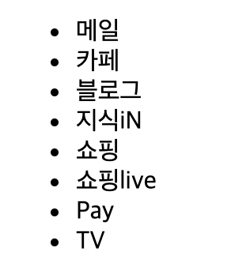
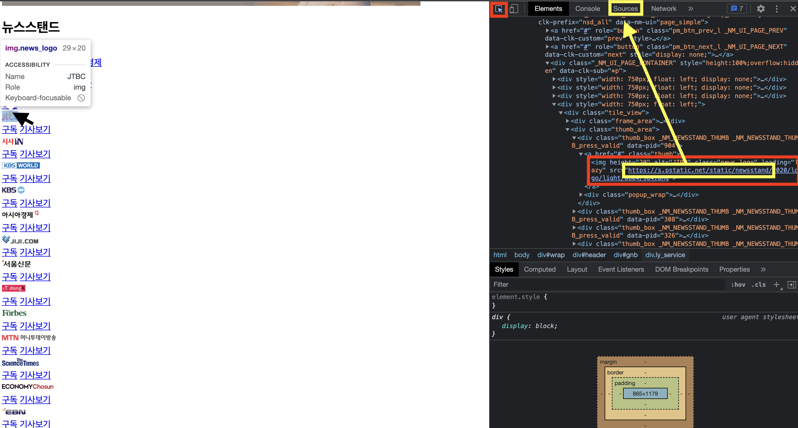
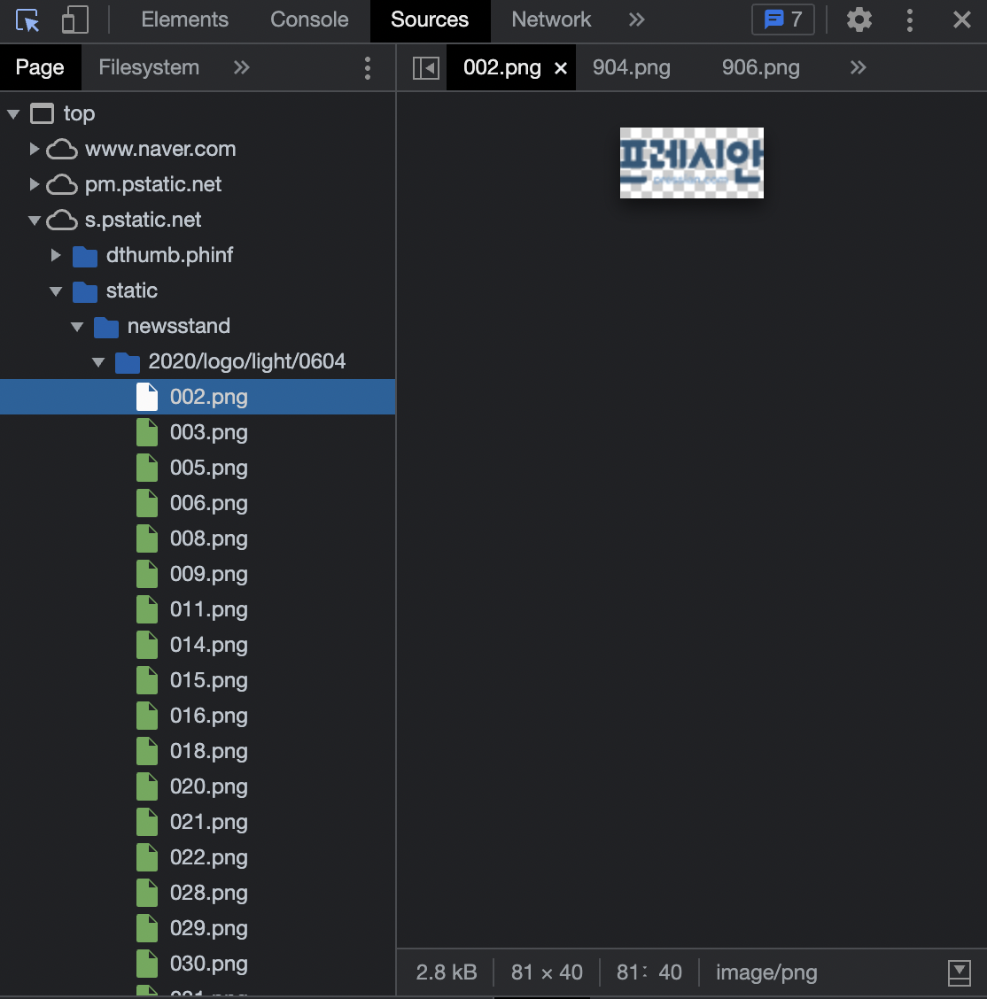
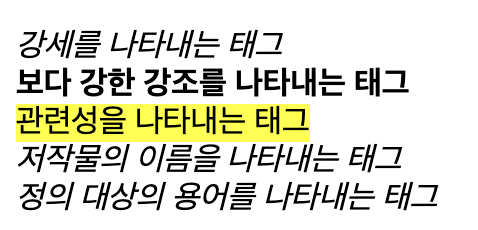

# 4. 자주 쓰는 다양한 태그들

## < 목차 >

1. 리스트
1. image
1. i <br/><br/>

## 1. 리스트

- ul : unordered list (순서 없는 리스트)
- ol : ordered list (순서 있는 리스트)
- li : list item (리스트 내 아이템)

&#43; span : 텍스트를 감싸는 태그
```html
<ul> <!--unordered list-->
    <li>메일</li> <!--list item-->
    <li>카페</li>
    <li>블로그</li>
    <li>지식iN</li>
    <li>쇼핑</li>
    <li>쇼핑live</li>
    <li>Pay</li>
    <li>TV</li>
```
  

## 2. image

이미지를 삽입할 수 있는 태그.

```html

```

src : 이미지의 절대/상대경로를 입력하는 속성 <br/>
alt : 스크린리더 등에서 읽힐 보조설명을 입력하는 속성<br/>

- 이미지 소스를 더 빨리 찾는 방법
  : 개발자도구에서 찾을 수 있음<br/>
  
  
  보안에 위협되는 이미지 이름을 쓰면 안됨!! 다 노출되기 때문!!!

## 3. i

: 텍스트에서 특정한 이유로 주위와 구분해야 하는 부분을 나타내는 태그. <br/>
(ex. 기술 용어, 외국어 구절, 등장인물의 생각 등) <br/>
주로 기울임꼴로 나타나나, 글자를 기울이기 위해서의 용도로만 i 태그를 쓰는 것은 비추. <br/>
디자인 요소는 CSS로 부여하는 것이 일반적! <br/>

- i 태그를 대체할 수 있는 태그들 :

  - &lt;em&gt; - 강세
  - &lt;strong&gt; - 보다 강한 강조
  - &lt;mark&gt; - 관련성
  - &lt;cite&gt; - 책, 공연, 음악 등 저작물의 이름
  - &lt;dfn&gt; - 정의 대상 용어

  ```html
  <em>강세를 나타내는 태그</em>
  <strong>보다 강한 강조를 나타내는 태그</strong>
  <mark>관련성을 나타내는 태그</mark>
  <cite>저작물의 이름을 나타내는 태그</cite>
  <dfn>정의 대상의 용어 나타내는 태그</dfn>
  ```
    

- 탭 넘어가는 처리가 되어야함. <br/>
  ui/ux와 접근성을 고려하며 개발하는 것이 중요함. <br/>
  (탭이 넘어가는 순서는 html 코드 순서와 거의 유사하나, 다르게 설정할 수도 있음.)<br/>
