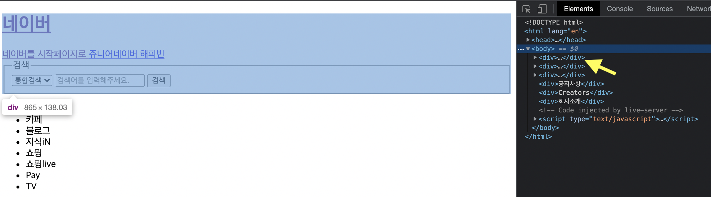

# 2-1. 레이아웃과 div 태그

## < 목차 >

1. 레이아웃 배치
1. div 태그  

+ 들어가기 전에 : 
디자인(css 등)에 전혀 영향을 받을 수 없는 사람들도 분명히 존재함 (ex. 시각장애인 등) 
이러한 사람들은 html로 구성된 데이터들로만 해당 웹사이트를 파악해야 하기 때문에, 개발자들은 이러한 기본 구조를 제대로 만들어야 할 의무가 있음. 

## 1. 레이아웃 배치
+ footer : 가장 마지막에 배치, 부가적인 정보를 담고 있음
+ header : 가장 위에 배치

+ 배치를 억지로 하면 유지보수가 어려워지거나 반응형 웹사이트 구축 시 제대로 작동하지 못 할 수 있다. -> 레이아웃 잡는 것에 심혈을 기울이길 바람

+ 배치를 쉽게 하는 법?
1. 구역을 가위로 오리듯이 "가로"로 먼저 나눌 것 (애매한 배치인 경우에도 가로부터 먼저 나눠볼것)
1. 가로로 나눌 것이 없으면, 그 안에서 "세로"로 나눌 것

## 2. div 태그
: 구역을 나눠주는 역할의 태그. 
개발자도구에서도 깔끔하게 나뉘어진 것을 확인할 수 있음. 
화면 내 가로줄 전체를 차지하는 크기. (너비 100%) 
  

+ 단점 - 이름이 모두 div이니 사용을 많이 할수록 역할 구별이 어려움 
ㄴ div에 역할 이름으로 id 값을 부여하거나 아예 header, nav, main, footer, article, aside, figure 등의 독립 태그(역할은 div와 동일)를 쓰기도 함 
  
단, 웹 표준에 입각한 규약이 존재한다. (main은 한 페이지에서 한 번밖에 못 쓴다.)