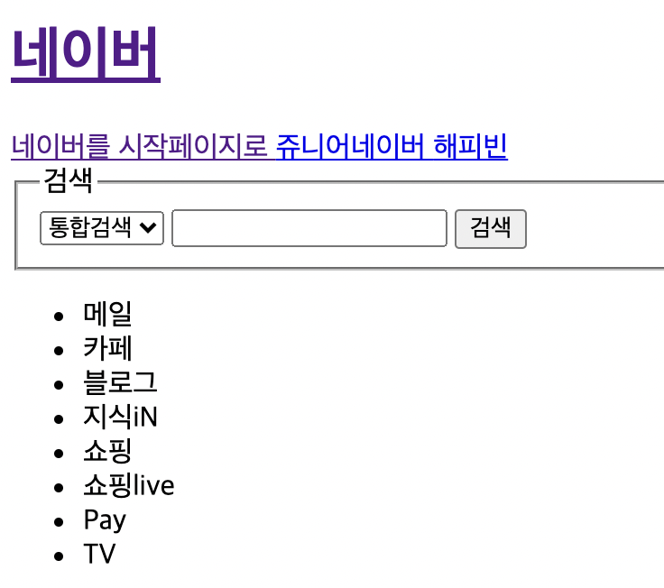
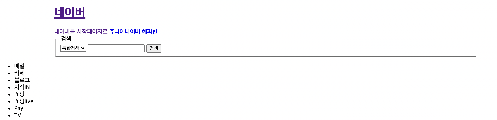
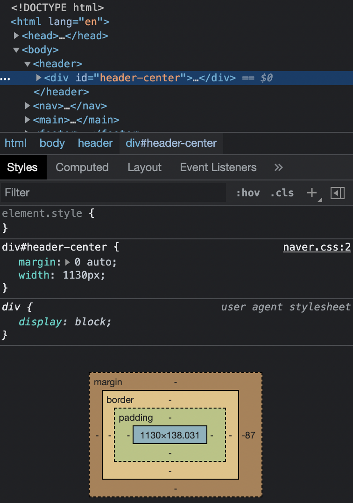

# 2-2. css와 선택자

## < 목차 >

1. CSS
1. 선택자
1. html-css 링크 <br/>

+ 들어가기 전 :<br/>
validation error - 네이버도 완벽하게 지키지는 못함. 적당히 조절하십쇼

## 1. CSS

문서적으로는 큰 의미 없지만, 디자인 배치 시 이용함.<br/>
문법은 속성명: 속성값 <br/>
다수 속성 이용 시 속성명1: 속성값1; 속성명2: 속성값2;<br/>

- 가장 간단히 css를 이용하는 법 : style attribute 이용하기<br/>
사이즈를 줄였다 늘렸다 하면 컨텐츠들이 자연스럽게 가운데 정렬됨<br/>
-> 먼저 가운데 정렬될 컨텐츠들을 div 그룹으로 묶어주는 것이 중요

ex) header 안에 div 태그 생성 후 style="margin: 0 auto" 부여<br/> => header 태그 기준으로 가운데 정렬할 그룹 생성

```html
<body>
  <header>
    <div style="margin: 0 auto"><!--가운데 정렬용 div--></div>
  </header>
</body>
```


ㄴ 하지만 가운데 정렬이 안되는 이유?<br/>
div 태그 자체가 가로가 꽉 찬 100% 비율이기 때문에, 가운데로 정렬하더라도 그대로 보이는 것!<br/>

그렇다면? 너비를 좁혀줘야 가운데 정렬이 가능!<br/>
공식 페이지에서 width 값을 따와 적용시켜준다.


```html
<body>
  <header>
    <div style="margin: 0 auto; width: 1130px;"></div>
  </header>
</body>
```
결과값 : 
 <br/>

- 컨텐츠 자체의 정렬과 구역 정렬을 구분할 것.
  (컨텐츠 정렬은 다른 방법이 있음!)
   <br/><br/>

## 2. 선택자

html의 태그를 선택하는 것.<br/>
지금 하고 있는 방법은 따로 문서를 만들지 않고 html 문서 안에 스타일 속성으로 css 속성을 부여함. (inline 스타일, 크게 권장하지는 않는 방법) <br/>
하지만 새로운 문서를 이용해 페이지에 값을 부여하는 경우가 일반적임. <br/>
이 때, css 내 요소를 적용하기 위해 html div태그에 id를 부여해 불러오는 선택자 작업이 필요함. <br/>

&lt;html&gt;

```html
<header>
  <div id="header-center">
    <h1>...</h1>
  </div>
</header>
```

&lt;css&gt;

```css
div#header-center {
  margin: 0 auto;
  width: 1130px;
}
```

이러한 작업 시, inline 작업이 아닌 새로운 css 문서를 이용하여 스타일 부여 가능. <br/>

- div는 생략 가능. 그러나 header 등의 다른 태그는 생략 불가. <br/>

- 여러 태그에 동시 적용 가능

```css
div#header-center,
div#mingling {
  margin: 0 auto;
  width: 1130px;
}
```

## 3. html-css 링크

html과 css 파일은 만들었으나, 자동으로 파일을 감지하지 않기 때문에 html head에 css파일을 링크하는 메타데이터를 삽입해야함.

```html
<html lang="en">
  <head>
    <meta charset="utf-8" />
    <link rel="shortcut icon" type="image/x-icon" href="./favicon.ico" />
    <link rel="stylesheet" href="./naver.css" />
    <title>NAVER</title>
  </head>
</html>
```

+ html에 적용되는 태그는 div태그 내에 있는 요소들에게도 적용됨<br/>
=> css의 특성!<br/>
cascading style sheet -> cascading : 덮어쓰다는 뜻.<br/>
조상(html)에 적용된 css는 자식(div) 속성에게도 덮어씌워진다고 생각하면 됨.<br/>
 <br/><br/>