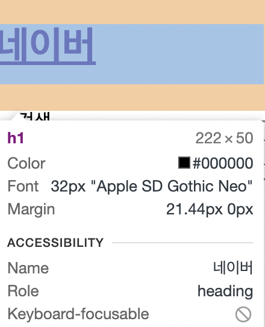
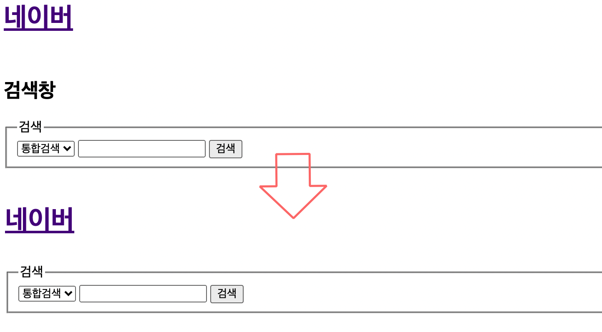
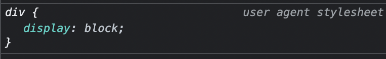
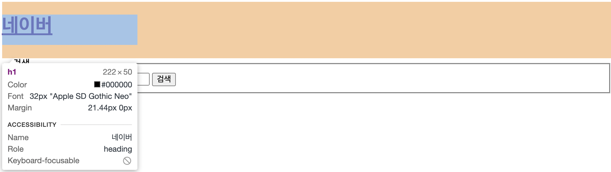
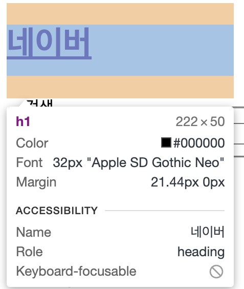
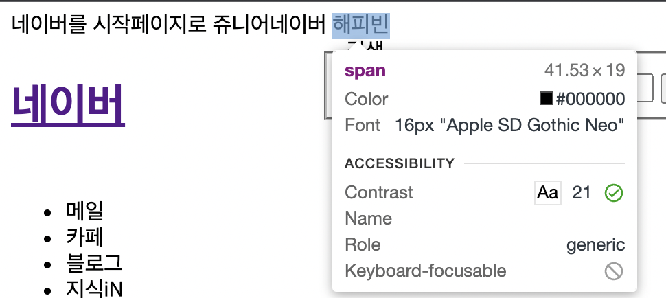
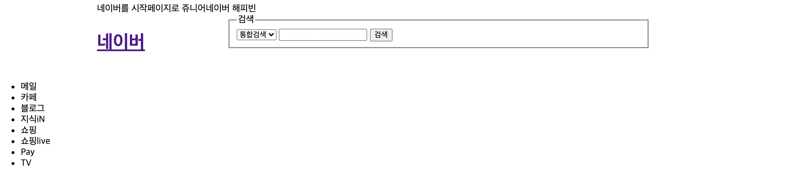

# 2-3. 픽셀과 자손/자식 선택자

## < 목차 >

1. 픽셀
1. 자손/자식 태그 선택자 
1. display: block;
1. span<br/><br/>

## 1. 픽셀
cm나 m와 달리 "상대적인 단위."
모니터의 해상도에 따라 픽셀이 달라짐.

+ 내 모니터의 픽셀을 알아보는 콘솔 명령어: 
```html
screen.width
=>1440

screen.height
=>900
```
</br></br>
## 2. 자식/자손 태그 선택자
한 태그 안에 있는 자식을 개별 선택해서 css를 적용할 수 있음.
(자식+손자=)자손 태그와 자식 태그를 선택할 때 차이점을 알아야 함.

+ 특정 태그에 px 지정하기
```html
    <header>
      <div id="header-center">
        <div id="header-top">
          ...
        </div>

        <div id="header-search">
          <h1>
            <a href="http://www.naver.com"> 네이버 </a>
          </h1>
```

```css
// 자식 선택자로 선택할 때
#header-search > h1{
  width: 222px;
  height: 50px;
}

//자손 선택자로 선택할 때
#header-center h1{
  width: 222px;
  height: 50px;
}
```

보통은 자손 선택을 많이 하는 편.
</br></br>

+ 특정 선택자가 보이지 않게 하기</br>
: 시각장애인 등의 유저에게는 스크린리더 사용 시 검색창이라는 정보값을 파악해야함. <br/>
=> 화면에서는 이미 시각적으로 검색창이 보이므로, h2 "검색창" 정보값을 숨기는 작업

```css
#header-center h2{
  display: none;
}
```

</br><br/><br/>

## 3. display: block;
div 태그에는</br>

속성이 항상 부여되어 있음.</br>
= 기본적으로 전체 너비를 다 차지하는 특성을 지님.</br></br>



파란색 : 실제 컨텐츠 영역</br>
주황색 : margin(경계)</br>
ㄴ 아무리 컨텐츠의 크기가 전체 너비보다 작더라도, </br>
전체 너비만한 margin이 자리를 차지하게 됨
</br></br>

+ 기본적으로 주어진 마진을 없애는 법
: display: block; 을 바꿔주면 됨.

```css
#header-search > h1 {
  width: 222px;
    height: 50px;
    display: inline-block;
}
```


```css
#header-search > fieldset {
  display: inline-block;
}
```


</br>
+ 어느 정도 익숙해지면 태그만 보고도 어떠한 페이지가 생성될지 예측해야함.

</br></br>
## 4. span
글자에 쓰는 태그.
inline 속성이 자동 부여됨.
```html
<span>네이버를 시작페이지로</span>
<span>쥬니어네이버</span>
<span>해피빈</span>
```


</br></br>

+ block / inline / inline-block 의 차이
  - block : width와 상관 없이 너비를 100% 다 차지함.
  - inline : 딱 컨텐츠 크기 만큼의 너비 차지.
  - inline-block : width/height의 크기 지정 가능.
</br></br>

+ span에 링크 넣기
```html
<span onclick="location.href='사이트주소'">
```

+ span 링크에 커서 올리면 손가락으로 바꿔주는 inline 스타일
```css
style=cursor.pointer;
```
</br></br>

## * 오늘의 결과물

