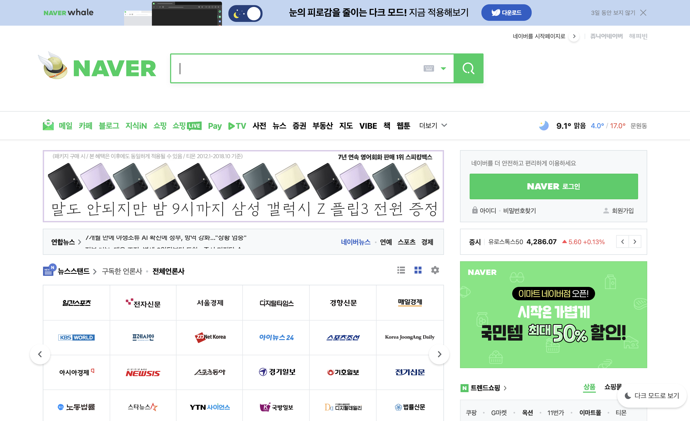
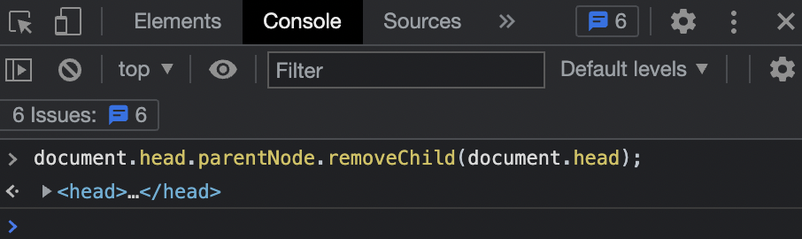
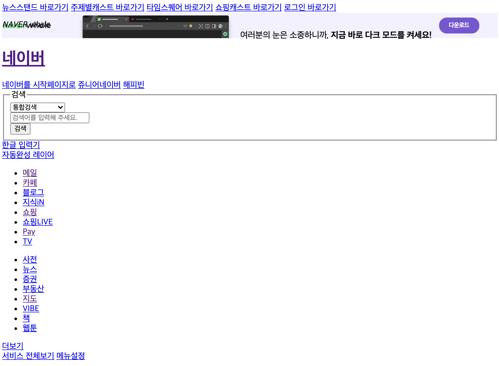

# 1. 웹의 기술적 구성요소
## < 목차 >
1. HTML / CSS / JS
1. 실습 맛보기 - naver 메인 페이지   

## 1. HTML / CSS / JS
1. html - 웹의 구조와 컨텐츠
1. css - 웹의 디자인
1. Javascript - 웹의 동작 -> 현재는 웹의 모든것. 
(컨텐츠와 디자인 모두 포용 가능한 수준까지 올라감) 

ㄴ 요즘 가장 중요한 건 js. 
그러나 html과 css를 배워야하는 이유는 요것들이 “기본기”이기 때문!!
+ 법인들 같은 경우에는 차별금지법 등을 지켜야 하기 때문에 장애인들을 위해 깔끔한 html 구축이 중요함.  
(필수적으로 이용하시는 스크린리더 등이 정상적으로 구동되기 위해서!)  
ㄴ 개발 시 웹접근성 규칙에 대해서도 꼭 숙지해야한다!

* 웹 is 문서 vs. 애플리케이션 : 기존은 문서, 최근 5년 전부터 어플리케이션 인식 급증. 
* 툴이나 언어 등등 실무를 위해서 <<개발자 영어>>를 잘해야한다 ㅠ  

## 2. 실습 맛보기 - naver 메인 페이지

: naver 기본 메인페이지   

: f12-개발자도구 콘솔에 본 코드를 작성하면...   

: naver 기본 메인페이지 
css를 대부분 제거하니 훨씬 더 문서처럼 순서대로 sorting되어있음.  

: 쇼핑 탭 
ㄴ iframe - 웹페이지 안에 다른 웹페이지가 들어갈 수도 있음.  
그래서 css를 제하더라도 디자인이 그대로 살아있을 수 있는 것.   