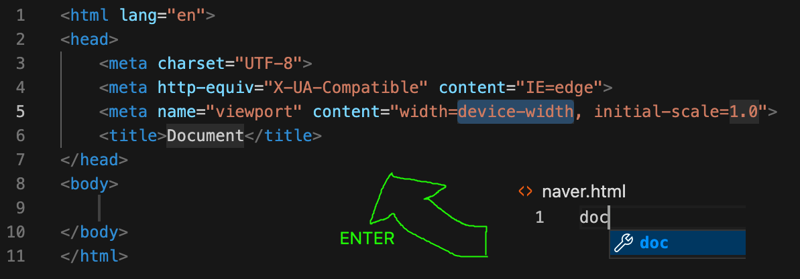
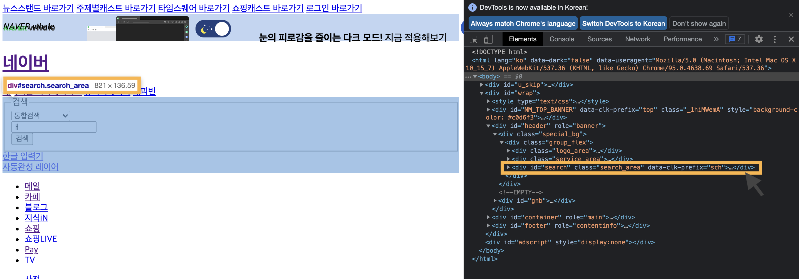
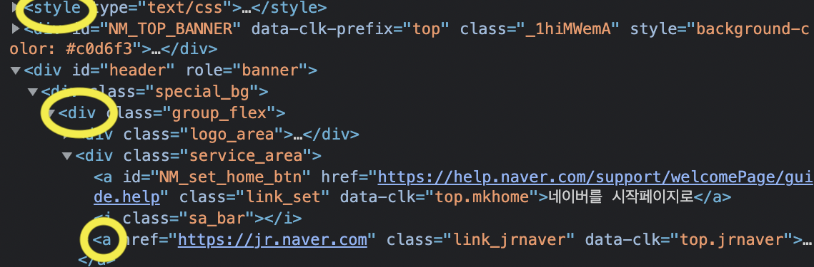
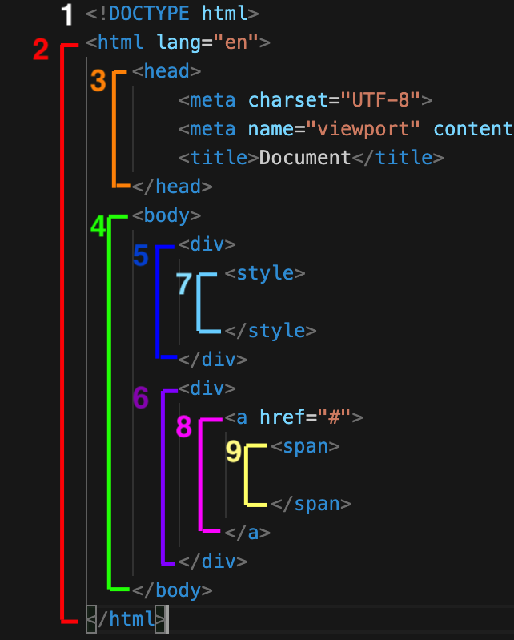

# 1-2. html 구조 알아보기
## < 목차 >
1. html 구조 - naver 메인 페이지를 중점으로   

## 1. html 구조 - naver 메인 페이지를 중점으로

: 코드 창에 doc 입력 및 엔터 -> html 구조 자동완성  
ㄴ 코드의 퀄리티 못지 않게 속도도 중요하다!  
프로그램의 숏컷 등을 이용한 시간 단축 및 효율성 증대가 굉장히 중요함. 
(코딩 속도가 느리다보면 업무 상 잘릴 수도 있다,,,)  

(특정 코드에 커서를 올리면 코드로 이루어진 해당 블록을 확인할 수 있다.) 

- 네이버 메인 코드 뜯어보기
    
    1. 태그의 모양새와 다양한 태그 찾기 
	    - 여는태그<>, 닫는태그</> 모양과 구조
        - div, a, style 등 코드에 쓰이는 다양한 태그들  
	
    1. 트리구조 
	: 일종의 계층을 이루는 코드 
    접었다 폈다 하는 기능을 통해 상/하위 태그 확인 가능 
        - 상위태그(부모, parent)
        - 하위태그(자식, child)
        - 동일계층태그(형제, sibling) 
    등 코드 속 태그의 계층 구조를 파악하며 작업하는 것이 필요.

+ xml, html4 : 옛날문서
+ 손자태그와 자손태그의 차이점 - css에서 중요  
    * 손자태그 : child의 하위 태그를 일컫는 말.
    * 자손태그 (descendant) : 자식, 손자 등 한 상위 태그 내의 후손들 모두를 통칭하는 태그.
    
- 실습 : html 기본 구조 속 태그의 기본적인 관계 정리해보기

1.  !doctype - 쌍태그가 없는 예외 태그 중 하나
+ parents - child : 2-3/4, 4-5/6 등
+ sibling : 3-4, 5-6 등
+ 손주(grandchild) : 4-7,8 등
+ descendant : 4- 5,6,7,8,9 등
