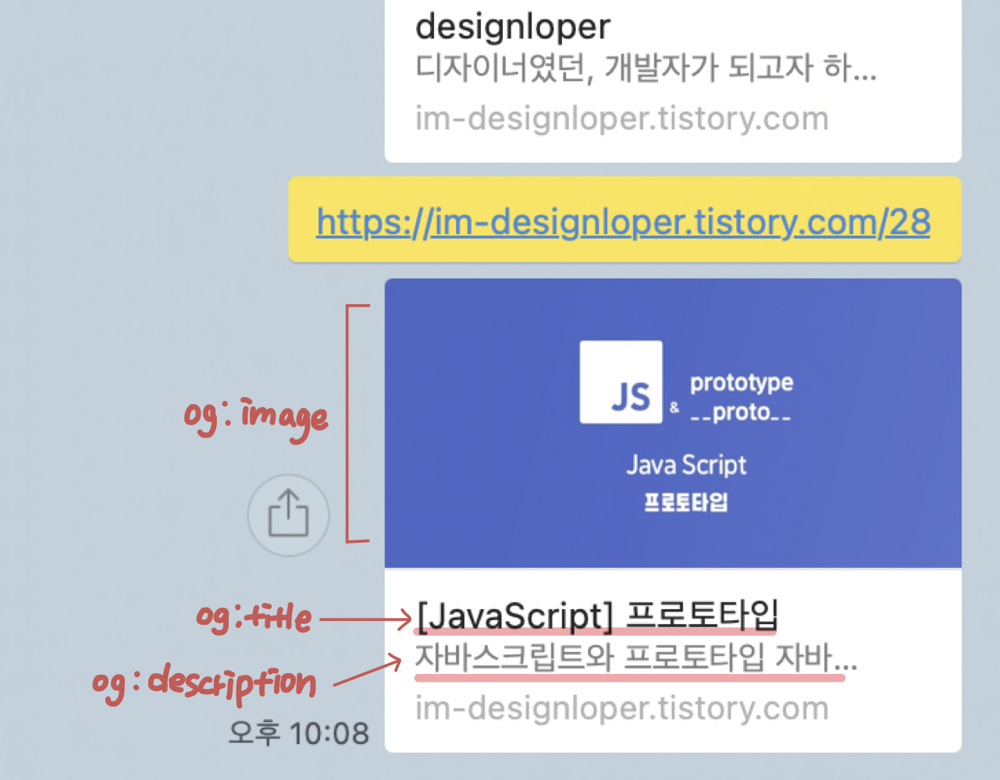
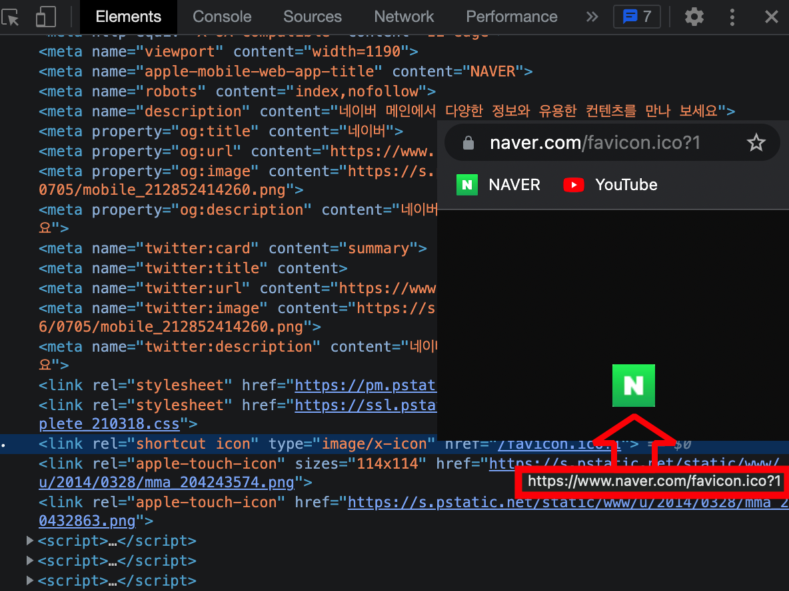
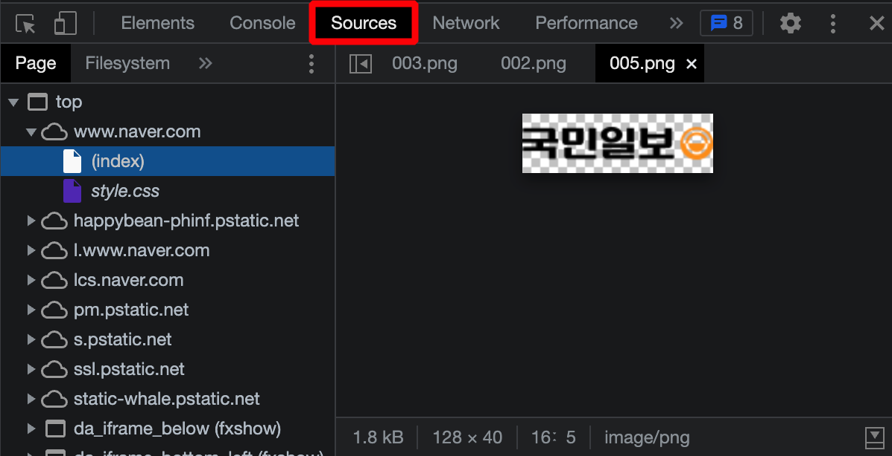

# 3. head 태그
## < 목차 >
1. &lt;head&gt;의 용도
1. meta 태그란?
1. 실습 - 웹사이트 타이틀 및 favicon 지정하기
<br/><br/>

## 1. &lt;head&gt;의 용도
head - 문서에 대한 부가적인 정보를 담고 있는 태그, 화면에 보이지 않음<br/>
(Body - 화면에 보여지는 것들을 담당)
* 어디까지가 화면인가?
	: 즐겨찾기 아래부터 + 스크롤바까지 화면.<br/>

* html이 엄격하지 않기 때문에 head에 body 요소가, 또는 그 반대여도 웬만해선 동작 가능. <br/>
그러나 작업 또는 협업을 위해서는 유저 다수가 따르는 규칙에 맞춰 코딩하는 것이 중요함.

* 참고 : 태그 안이 비어있다면, 여는 태그 안에 /를 써서 바로 닫을 수 있다. 
ex) &lt;body /&gt; <br/><br/>

## 2. meta 태그란?
: 문서에 대한 정보를 나타내는 태그<br/>
닫는 태그가 엄격히 따지면 있어야하나, 자유도가 높은 시스템이기 때문에 굳이 쓰지 않아도 됨<br/>
하지만 프레임워크 공부를 위해서는 꼭 닫는 태그 신경쓸 것!!! <br/>

```html
<!DOCTYPE html>
<html lang="ko">
  <head>
      <meta charset="UTF-8">
      <meta name="viewport" content="">
      <meta name="keywords" content="">
      <meta name="description" content="">
      <meta name="author" content="">
      <meta name="robots" content="">
      <meta property="og:type" content="">
      <meta property="og:title" content="">
      <meta property="og:description" content="">
      <meta property="og:image" content="">
      <meta property="og:url" content="">
  </head>
</html>
```

1. lang 속성<br/>
: 스크린 리더가 지정된 언어를 인지하고 읽기 위한 속성 <br/>
속성 개별 선언도 가능.      ex - &lt;span lang="ko"&gt;한글&lt;/span&gt;
1. charset<br/>
: html5의 인코딩 지정 방법<br/>
보통 UTF-8(유니코드 형식의 하나로, 전세계 거의 모든 문자 표현 가능)가 기본값
1. viewport<br/>
뷰포트 = 화면에 보이는 영역<br/>
스크롤해서 봐야하는 영역을 제외한, 보이는 그대로의 크기만큼의 영역을 뜻함.<br/>
아래는 head 영역에서 가장 많이 쓰이는 코드.<br/>
* 너비 = 보고있는 기기의 넓이 <br/>
* 초기화면 비율 = 넓이에 맞춰 1배로 지정<br/>
```html
<meta name="viewport" content="width=device-width, initial-scale=1">
```
4. keyword<br/>
: 해당 컨텐츠 내용의 대표적인 키워드 지정<br/>
검색 엔진의 결과에 반영 가능
1. description <br/>
: 해당 페이지의 설명란<br/>
검색 시 페이지 내용의 요약 섹션에 반영되는 항목
1. author<br/>
: 웹 페이지의 소유자(또는 회사)를 기재하는 항목
1. robots<br/>
: 기본적으로 검색 엔진 크롤러의 허용/불허 제어
robots 메타태그 보다는 주로 robots.txt 파일로 제어하는 것이 일반적
1. property="og:" <br/>
: og(opengraph) - 웹페이지가 소셜미디어 또는 오픈그래프를 활용환 사이트로 공유될 때 사용되는 정보.

출처 - https://velog.io/@byeol4001/Meta-Tag-OG%EC%98%A4%ED%94%88%EA%B7%B8%EB%9E%98%ED%94%84-%EC%82%AC%EC%9A%A9%ED%95%98%EA%B8%B0
- type : 웹페이지의 타입
- title : 콘텐츠 제목
- description : 웹페이지의 설명
- image : 표시되는 이미지
- url : 웹페이지의 링크 <br/><br/>
메타태그 관련 참고글 : https://junhobaik.github.io/meta-tag/<br/><br/>


## 3. 실습 
### - 웹사이트 타이틀 및 favicon 지정하기
1. 웹사이트 타이틀 설정하기
: &lt;title&gt; 태그를 이용해 웹페이지의 타이틀을 설정한다. 
```html
<!DOCTYPE html>
    <head>
        <meta charset="utf-8">
        <title>NAVER</title>
    </head>
    <body>

    </body>
</html>
```

2. favicon 설정하기<br/>

: favicon 이미지를 구하는 방법

```html
<!DOCTYPE html>
    <head>
        <meta charset="utf-8">
        <link rel="shortcut icon" type="image/x-icon" href="./favicon.ico" />
        <title>NAVER</title>
    </head>
    <body>

    </body>
</html>
```
ㄴ rel -> favicon 의미<br/>
ㄴ type -> favicon 다시 의미<br/>
ㄴ href(hyper-reference)-> 파일의 경로<br/>

결과물 :


* 웹페이지의 소스를 알아보고 싶다면, 개발자 도구의 source 탭을 이용하기.



